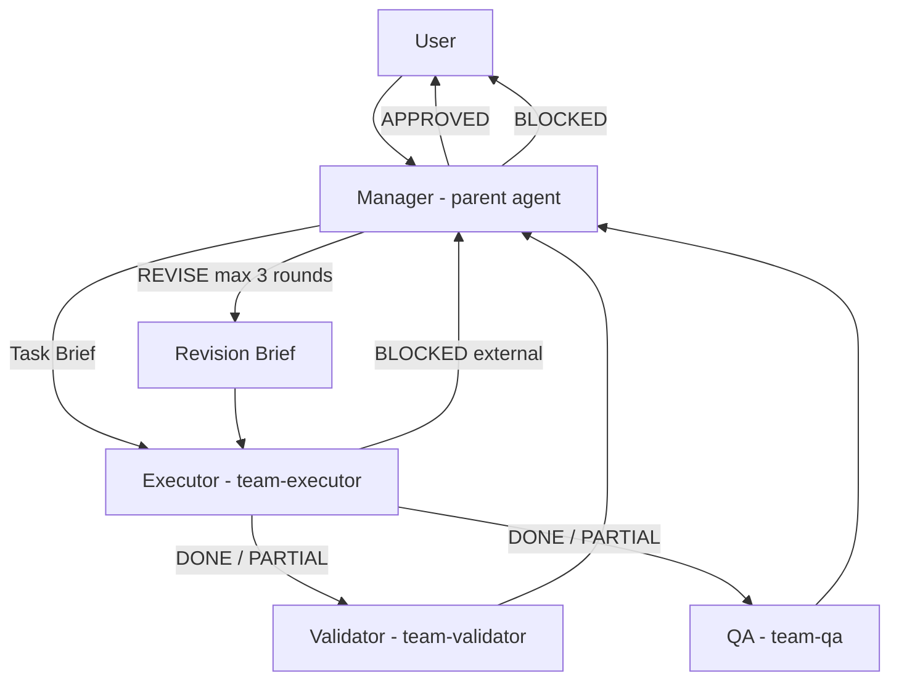

# Agent Team

**A four-role Cursor skill that delegates work with quality gates — Manager, Executor, Validator, and QA — so you ship with evidence, not hope.**

Agent Team turns a single Cursor chat into a managed pipeline: you frame the task, an Executor delivers, Validator and QA review in parallel, and you issue a clear verdict. Structured revision loops, external-blocker short-circuits, and a hard cap of three rounds keep the workflow predictable.

## Install

### Option A — install script (recommended)

```bash
git clone https://github.com/SahilGarg28/cursor-agent-team.git
cd cursor-agent-team
chmod +x install.sh
./install.sh
```

The script copies `skill/` to `~/.cursor/skills/agent-team/` and `agents/*.md` to `~/.cursor/agents/`. It prompts for confirmation before writing.

### Option B — manual copy

```bash
mkdir -p ~/.cursor/skills/agent-team ~/.cursor/agents

cp -R skill/. ~/.cursor/skills/agent-team/
cp agents/team-*.md ~/.cursor/agents/
```

Restart Cursor or open a new chat so the skill and agents are picked up.

## Publishing

Use these steps on another machine to zip, publish, or push to GitHub:

1. **Transfer the repo** — zip and unzip, or copy via `scp`:
   ```bash
   scp -r /path/to/cursor-agent-team user@other-host:~/
   ```
2. **Initialize git** (run on the target machine, not during install):
   ```bash
   cd cursor-agent-team
   git init
   git add .
   git commit -m "Initial commit: Agent Team skill and agents"
   ```
3. **Create a GitHub repo** — on [github.com/SahilGarg28](https://github.com/SahilGarg28), create an empty repository named `cursor-agent-team`.
4. **Add remote and push:**
   ```bash
   git remote add origin https://github.com/SahilGarg28/cursor-agent-team.git
   git branch -M main
   git push -u origin main
   ```

## Quick start

In any Cursor chat:

```
/agent-team fix the null pointer in RefundService
```

Or:

```
Use the agent team to research why batch a5f561ce4 had 40% failures
```

The parent agent acts as **Manager**: it writes a Task Brief with testable acceptance criteria, launches `team-executor`, then runs `team-validator` and `team-qa` in parallel. You get an outcome report — **APPROVED** or **BLOCKED** — with deliverables and a team verdict table.

See [skill/examples.md](skill/examples.md) for APPROVED, REVISE, and BLOCKED walkthroughs.

## Architecture



**Flow summary**

1. Manager writes Task Brief + acceptance criteria
2. Executor delivers
3. If Executor is BLOCKED on an external dependency → Manager BLOCKED immediately (Validator/QA skipped)
4. Else Validator + QA review in parallel
5. Manager: APPROVED | REVISE | BLOCKED
6. REVISE → Revision Brief → Executor → repeat (max 3 rounds)
7. Present outcome + team report

Full orchestration rules: [skill/SKILL.md](skill/SKILL.md).

## File tree

```
cursor-agent-team/
├── README.md
├── LICENSE
├── install.sh
├── .gitignore
├── skill/
│   ├── SKILL.md          # Orchestration skill (Manager workflow)
│   └── examples.md       # APPROVED / REVISE / BLOCKED patterns
├── agents/
│   ├── team-executor.md  # Delivers the work
│   ├── team-validator.md # Checks acceptance criteria
│   ├── team-qa.md        # Holistic quality review
│   └── team-manager.md   # Ad-hoc Manager contract (parent is Manager in /agent-team)
└── docs/
    └── POST.md           # Draft launch post
```

## Requirements

- **[Cursor](https://cursor.com)** with Agent mode and **Task subagents** enabled
- Four custom agents installed to `~/.cursor/agents/` (`team-executor`, `team-validator`, `team-qa`, `team-manager`)
- Skill installed to `~/.cursor/skills/agent-team/`
- Optional: `bugbot` or `security-review` subagents for code-heavy QA (Manager may launch these)

Model slugs in SKILL.md are suggestions only; omit `model` on Task calls if a slug is unavailable.

## When to use

- Non-trivial tasks where you want **testable acceptance criteria** before work starts
- Code, research, writing, debugging, analysis, or ops work that benefits from **separate execution and review**
- When you want structured **revision loops** instead of open-ended “try again”
- When missing credentials or access should **short-circuit** instead of burning review rounds

## When not to use

- Trivial one-liner fixes (“rename this variable”) — overhead exceeds benefit
- Tasks with no clear success criteria and no willingness to define them
- Environments without Task subagent support
- Fully autonomous unattended runs — Manager (you) still synthesizes verdicts and presents results

## License

MIT — see [LICENSE](LICENSE). Copyright (c) 2026 Sahil Garg.
